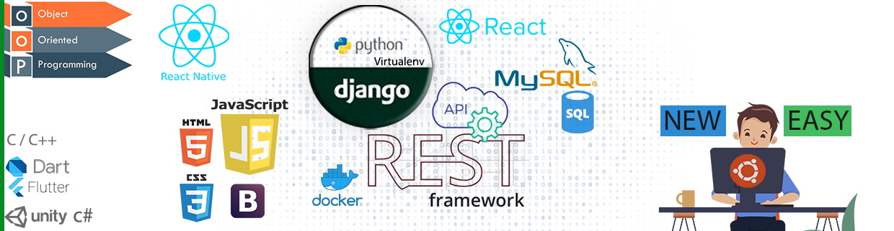

<a target="_blank" href="https://github.com/niamul64/niamul64/blob/main/Capture.JPG"></a>

<br>
<a target="_blank" href="https://github.com/niamul64/niamul64/blob/main/batch%20topper%20with%20title.png"></a>

## Hi, I am Niamul Hasan. 
#### I am very proficient in the Django framework. (Can work with Django_REST_API)
#### Programmer(Python3) | Web developer(Django) | App Developer(React-Native)
<hr>

[](https://www.linkedin.com/in/niamul-hasan-b74489118/) &nbsp; &nbsp;
[ ](https://niamul64.github.io/) &nbsp; &nbsp;
[ ](https://www.facebook.com/mn.hr.37/) &nbsp;
<h2><a href="mailto: 17201026@uap-bd.edu">Email: 17201026@uap-bd.edu</a></h2> 
<hr>

### About Me:
Study: (BSc E.) Computer Science and Engineering; &nbsp; &nbsp; CGPA: 3.89 <br> (University of Asia Pacific)   <br>
I'm a Computer Programmer, Website Developer(Backend, Django), Graphics Designer. I enjoy developing web applications using Django. I have profound knowledge in Problem Solving. Now, practicing Machine Learning, Deep Learning. Earlier in my university life, I have participated in many competitive programming (ICPC). So, I have a good knowledge to do programming under pressure.
<br>
I'm always eager to put in extra effort to learn new things. 
<hr>

## My Skills:

### To Better understand, about my skills, please visit my Web-Site: [My Web-Site](https://niamul64.github.io/)

```
{
   "Proficient":  ["Python3", "Django", "SQL", "RDMS", "Object Oriented Programming", "Selenium with python3", 
                                           "C", "C++","HTML", "CSS", 'Bootstrap'],
                  
   "Improving":  ["JavaScript", "React", "React-Native"],
   
   "Learned"  :  [ "Dart" , "Flutter", "Java", "Java-GUI", "Unity3D", "C#" ],

   "Backend Web development": ["Django: Can work with Django REST API"],
   "Database":                ["MySql", "MS SQL Server", "Sqlite3"],
   "AI framework":            ["Keras", "Scikit-learn", "Tensorflow"],
   "Modules & Library":       ["Pandas","Numpy","Scipy","Matplotlib" ],
                          
   "Machine Learning Algorithms/ Deep Learning ": ["LinearRegression","LogisticRegression","KNeighborsRegressor",
    (Practicing)                                   "SVM","KNN","Naive Bayes", "CNN", "VGG16", "Resnet50" ,
                                                  "K-means", "Model Validation", "DecisionTree" , "Inception V3"]
}
```

👯 Now I’m looking to collaborate with a team that may help me to progress on my skill.
- 🔭 I’m currently Open to work 
- 🌱 I’m currently learning Javascript /Machine Learning / Deep Learning 
- 👯 I’m looking to collaborate with Django Backend Team 


  

  

<hr>

## Some Course Certificates
[Crash Course on Python by google](https://www.coursera.org/account/accomplishments/certificate/F53L2Z9AGZKZ)
<br>
[Front-End Web UI Frameworks and Tools: Bootstrap 4 by The Hong University Of Science And Technology](https://www.coursera.org/account/accomplishments/certificate/YHW6MME3UEZ3)
<br>

[HTML, CSS, and Javascript for Web Developers by Johns Hopkins University](https://www.coursera.org/account/accomplishments/certificate/F3QEHCSR7AXD)
<br>
[Web Application Technologies and Django](https://www.coursera.org/account/accomplishments/certificate/BQ3T4Z63V2WT)
 <br>
[Building Web Applications in Django](https://www.coursera.org/account/accomplishments/certificate/WYPKV6NEA5UM)
 <br>
[What is Data Science](https://www.coursera.org/account/accomplishments/certificate/H8JFGFKJB2HX)

## 

  


